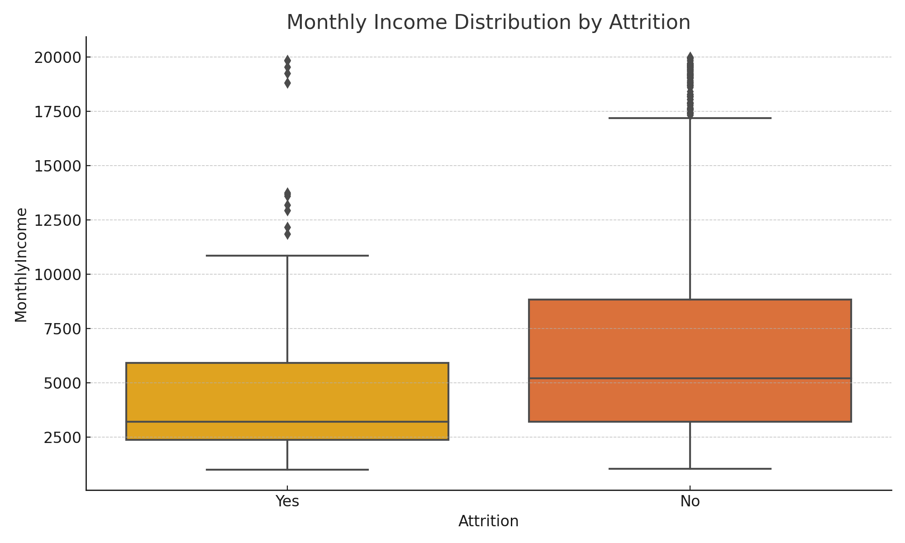
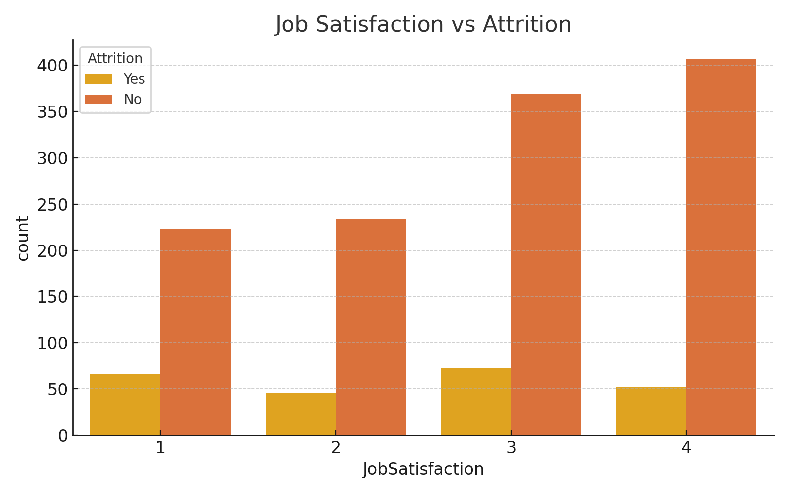
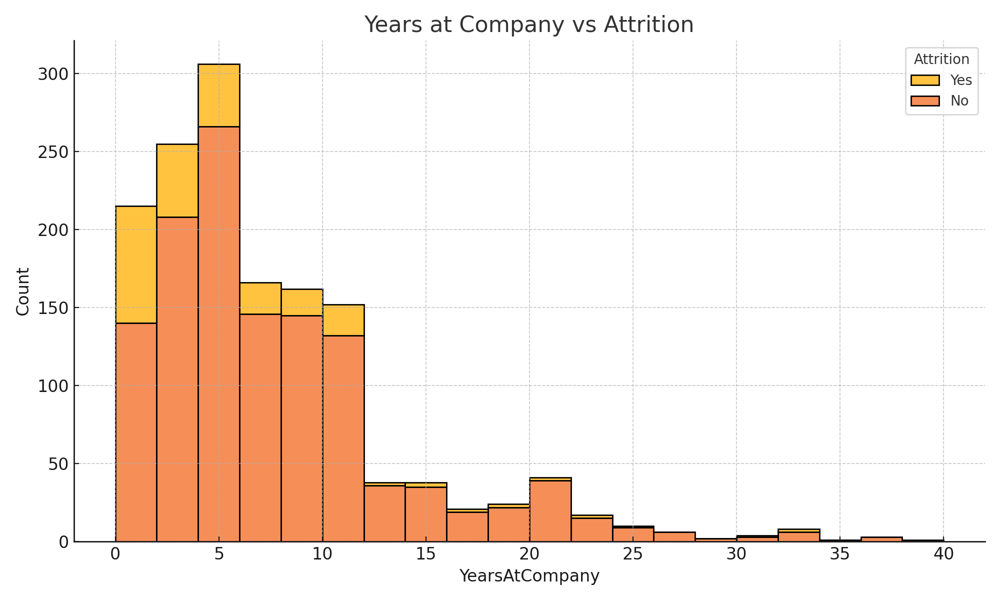

# Employee Attraction Analysis


<br>
<br>


## 📘 Project Description
This project explores why employees leave by analyzing IBM’s HR Analytics dataset using SQL and Python. The goal was to find meaningful patterns in attrition across departments, roles, income, and satisfaction levels.

<br>

### Key steps:
- Cleaned and structured the raw CSV data into a relational database using MySQL  
- Wrote 15+ SQL queries to analyze attrition by job role, age, satisfaction, and work-life balance  
- Visualized trends with Seaborn and Matplotlib, highlighting insights like higher attrition among those working overtime or with low satisfaction  
- Summarized findings to help HR teams better understand turnover and improve retention strategies  
- Delivered an end-to-end analysis that turns employee data into actionable insights through clear visuals and storytelling  

---

## 📂 Project Structure

```
employee_attrition_project/
├── data/                  # Raw dataset (CSV)
├── db/                    # SQL schema and analysis queries
├── src/                   # Python analysis scripts
├── dashboard/             # PowerBI dashboard
├── notebooks/             # Jupyter notebooks
└── README.md
```

---

## 🧰 Technologies

- Python (Pandas, Matplotlib, Seaborn)
- SQL (MySQL)
- CSV data format


---

## 📊 Key SQL Queries

- Attrition rate by department
- Average income by role
- Job satisfaction vs overtime
- Years at company grouped by attrition
- Income group analysis

---

## 📈 Python Analysis

- Attrition by department (bar chart)
- Overtime vs attrition heatmap
- Satisfaction score distributions


## 🔍 Analysis Questions & SQL Insights

Here are key business questions answered with SQL queries and summarized insights:

---

### 1. What is the overall attrition rate?
```sql
SELECT Attrition, COUNT(*) AS Count FROM employees GROUP BY Attrition;
```
✅ ~16% of employees have left the company.

<br>


### 2. Which department has the highest attrition?
```sql
SELECT Department, SUM(CASE WHEN Attrition = 'Yes' THEN 1 ELSE 0 END) AS Attritions
FROM employees
GROUP BY Department;
```
✅ Sales department shows the highest attrition.

<br>


### 3. Does overtime correlate with attrition?
```sql
SELECT OverTime, Attrition, COUNT(*) FROM employees GROUP BY OverTime, Attrition;
```
✅ Most employees who left were working overtime.

<br>


### 4. What’s the average monthly income of those who left vs stayed?
```sql
SELECT Attrition, AVG(MonthlyIncome) FROM employees GROUP BY Attrition;
```
✅ Employees who left had lower average income.

<br>


### 5. Which job roles have the highest turnover?
```sql
SELECT JobRole, SUM(CASE WHEN Attrition = 'Yes' THEN 1 ELSE 0 END) AS Attritions
FROM employees
GROUP BY JobRole;
```
✅ Sales Executives and Lab Technicians show the most attrition.

<br>


### 6. How does job satisfaction affect attrition?
```sql
SELECT JobSatisfaction, COUNT(*) AS Count
FROM employees
WHERE Attrition = 'Yes'
GROUP BY JobSatisfaction;
```
✅ Most who left had job satisfaction ratings of 1 or 2.

<br>


### 7. Do employees with fewer years at the company leave more?
```sql
SELECT Attrition, AVG(YearsAtCompany) FROM employees GROUP BY Attrition;
```
✅ Yes — they averaged fewer years at the company.

<br>


### 8. Are certain education fields more prone to attrition?
```sql
SELECT EducationField, COUNT(*) AS Total, 
       SUM(CASE WHEN Attrition = 'Yes' THEN 1 ELSE 0 END) AS Attritions
FROM employees
GROUP BY EducationField;
```
✅ Life Sciences and Medical fields had the most attrition.

<br>


### 9. What is the average age of employees who left vs stayed?
```sql
SELECT Attrition, AVG(Age) FROM employees GROUP BY Attrition;
```
✅ Employees who left were slightly younger on average.

<br>


### 10. Does marital status influence attrition?
```sql
SELECT MaritalStatus, COUNT(*) AS Total, 
       SUM(CASE WHEN Attrition = 'Yes' THEN 1 ELSE 0 END) AS Attritions
FROM employees
GROUP BY MaritalStatus;
```
✅ Single employees showed higher attrition counts.

<br>

### 11. Is there a pattern between distance from home and attrition?
```sql
SELECT Attrition, AVG(DistanceFromHome) FROM employees GROUP BY Attrition;
```
✅ Employees who left tended to live farther from work.

<br>


### 12. What is the attrition breakdown by gender?
```sql
SELECT Gender, Attrition, COUNT(*) FROM employees GROUP BY Gender, Attrition;
```
✅ Males had slightly more attritions than females.

<br>


### 13. What stock option levels are most common among employees who stay?
```sql
SELECT StockOptionLevel, COUNT(*) 
FROM employees 
WHERE Attrition = 'No'
GROUP BY StockOptionLevel;
```
✅ Most retained employees had Stock Option Level 1.

<br>


### 14. How does the number of companies worked impact attrition?
```sql
SELECT NumCompaniesWorked, Attrition, COUNT(*) 
FROM employees
GROUP BY NumCompaniesWorked, Attrition;
```
✅ Employees who worked at more companies were more likely to leave.

<br>


### 15. Do employees with better work-life balance leave less?
```sql
SELECT WorkLifeBalance, Attrition, COUNT(*) 
FROM employees
GROUP BY WorkLifeBalance, Attrition;
```
✅ Those with poor work-life balance had higher attrition.

---

## 📊 Visualizations

### Attrition by Job Role  


### Monthly Income by Attrition  


### Job Satisfaction vs Attrition  


### Years at Company vs Attrition  



---

## 📎 Dataset Source

[IBM HR Analytics Dataset](https://www.kaggle.com/datasets/pavansubhasht/ibm-hr-analytics-attrition-dataset)

---

## 👤 Author

**Ricky Peña Jr.**  
🔗 [rickypenajr.github.io](https://rickypenajr.github.io)  
🌐 [GitHub](https://github.com/rickypenajr) • [LinkedIn](https://linkedin.com/in/rickypenajr)
